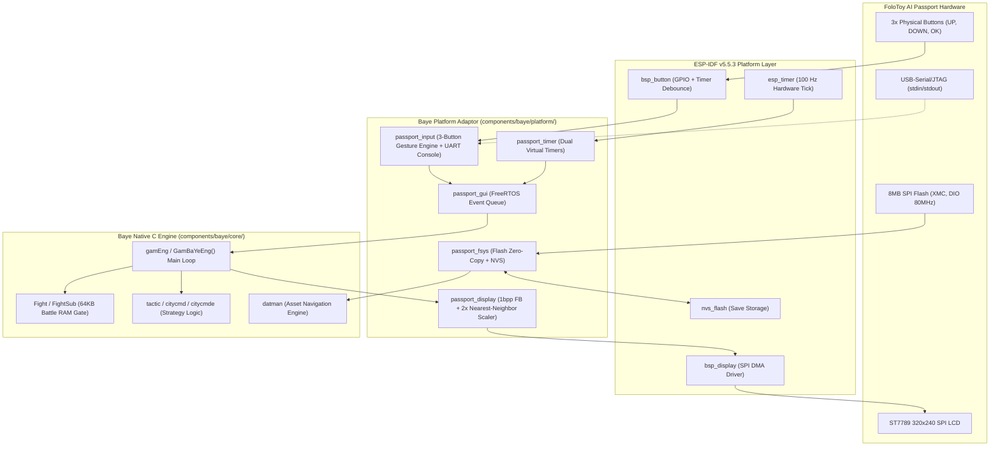

# AI Passport Baye: System Architecture Reference (V1)

**Version:** 1.0.0  
**Target Hardware:** FoloToy AI Passport (ESP32-C3 revision v1.1, 8MB Flash)  
**SDK:** ESP-IDF v5.5.3  
**Game Engine:** Native C iBaye / BBK Sango Core  

---

## 1. System Overview

`ai-passport-baye` is a native C port of the classic *Sango / Baye* (三国霸业) game engine running directly as an independent application on the ESP32-C3 RISC-V microcontroller inside the FoloToy AI Passport handheld.



---

## 2. Display Subsystem Architecture

### 2.1 Logical to Physical Mapping
- **Game Engine Resolution:** 160 × 96, 1-bit per pixel (1bpp packed, 20 bytes/row, 1,920 bytes total).
- **Physical LCD Panel:** ST7789, 320 × 240, 16-bit RGB565.
- **Scaling Factor:** 2× nearest-neighbor expansion ($160 \times 2 = 320$ px width, $96 \times 2 = 192$ px height).
- **Centering & Letterboxing:** Top letterbox: $Y = 0 \dots 23$ (24 px black). Bottom letterbox: $Y = 216 \dots 239$ (24 px black). The game renders at $Y = 24 \dots 215$ centered vertically.

### 2.2 Memory-Efficient Single Strip Buffer
Instead of allocating a full $320 \times 240 \times 2 = 153,600$ byte frame buffer (which would consume ~38% of total ESP32-C3 SRAM), the driver renders into a single 10 KiB DMA strip buffer:
- **Strip Height:** 8 logical rows = 16 physical rows ($320 \times 16 = 5,120$ pixels).
- **Strip Buffer Size:** $5,120 \times 2 = 10,240$ bytes allocated in DMA-capable internal SRAM (`MALLOC_CAP_DMA | MALLOC_CAP_INTERNAL`).
- **Full Refresh:** 12 strips cover the 96 logical rows.

### 2.3 Strict Fail-Closed DMA Lifecycle
ESP-IDF's `esp_lcd_panel_draw_bitmap()` initiates background SPI DMA transfer and returns immediately before transmission finishes. Re-using or modifying the source buffer while DMA is active causes pixel ghosting and visual artifacts.

To enforce 100% memory safety:
1. Every bitmap submission (Baye renderer strips, Battery HUD, and Volume HUD) is routed through the unified synchronous helper `passport_display_draw_bitmap_sync()`:
   ```c
   esp_err_t passport_display_draw_bitmap_sync(int x_start, int y_start, int x_end, int y_end, const void *color_data) {
       esp_lcd_panel_handle_t panel = bsp_display_panel();
       if (!panel || !color_data) return ESP_ERR_INVALID_STATE;

       esp_err_t err = esp_lcd_panel_draw_bitmap(panel, x_start, y_start, x_end, y_end, color_data);
       if (err != ESP_OK) {
           s_lcd_submit_fail_count++;
           ESP_LOGE(TAG, "draw_bitmap submit failed: %s", esp_err_to_name(err));
           return err;
       }

       err = bsp_display_wait_trans_done(100);
       if (err != ESP_OK) {
           s_dma_timeout_count++;
           ESP_LOGE(TAG, "wait DMA timeout: %s; fail-closed waiting...", esp_err_to_name(err));
           err = bsp_display_wait_trans_done(UINT32_MAX);
           if (err != ESP_OK) return err;
       }
       return ESP_OK;
   }
   ```
2. If `esp_lcd_panel_draw_bitmap` fails: flush is aborted fail-closed without waiting on an idle DMA channel, and submit failure counter increments.
3. If `bsp_display_wait_trans_done(100)` times out: logs error, increments `s_dma_timeout_count`, and blocks indefinitely (`UINT32_MAX`) until hardware clears. The buffer is never modified concurrently. All callers (Baye strips, Battery widget, Volume widget) share this exact guarantee.

**Performance on Real Hardware:**
- Full flush duration: ~31.5 ms (theoretical ~31.8 fps).
- Real-world telemetry: 0 DMA timeouts, 0 LCD submit failures.

---

## 3. Memory Layout & SRAM Budgets

The ESP32-C3 has ~400 KB total internal SRAM shared across ROM code, bootloader, Wi-Fi/BT stacks (disabled), FreeRTOS heap, and tasks.

| Memory Segment | Allocation Strategy | Size | Lifetime |
| :--- | :--- | :--- | :--- |
| **Battle RAM Gate** | Static buffer (`g_FightMapData`) | 65,536 bytes (64 KB) | Permanent (BSS) |
| **Game Task Stack** | Dedicated FreeRTOS task stack | 16,384 bytes (16 KB) | Permanent |
| **DMA Strip Buffer** | `heap_caps_malloc(MALLOC_CAP_DMA)` | 10,240 bytes (10 KB) | Permanent |
| **1bpp Primary FB** | Static BSS buffer | 1,920 bytes (~1.9 KB) | Permanent |
| **1bpp Backup FB** | Static BSS buffer | 1,920 bytes (~1.9 KB) | Permanent |
| **Shared Working Mem** | `_shm_init()` in BSS/heap | ~22,000 bytes (~22 KB) | Permanent |
| **ROM Assets (`dat.lib` / `font.bin`)** | Flash Memory-Mapped (`_binary_*`) | 360,730 bytes (352 KB) | Zero SRAM |
| **Available Free Heap** | FreeRTOS Heap | **~150,000 bytes (~146 KB)** | Dynamic |
| **Largest Free Block** | FreeRTOS Heap | **~114,688 bytes (~112 KB)** | Contiguous |

### Stack High Water Mark Verification
The game task is provisioned with 16,384 bytes. Runtime profiling across title screen, menu, lord selection, AI turn processing, and battle paths shows:
- **HWM Free Stack:** ~14,372 bytes free.
- **Actual Peak Stack Consumption:** ~2,012 bytes (<13% of allocation).

---

## 4. File System & Storage Architecture

1. **Read-Only ROM Assets (`dat.lib` & `font.bin`):**
   - Embedded into binary image via `target_add_binary_data(app ... BINARY)`.
   - ESP-IDF memory-maps the partition to CPU address space via SPI Flash cache (MMU).
   - `gam_fopen()` binds directly to `_binary_dat_lib_start` and `_binary_font_bin_start`.
   - Zero-copy reads: `gam_freadall()` and `g_CBnkPtr` point directly into Flash address space, consuming 0 bytes of SRAM.
   - Hardened with bounds checking in `gam_fload()`, `gam_fread()`, and `gam_fseek()`.
2. **Persistent Save Game Storage (`sango0.sav` … `sango5.sav`):**
   - Stored in ESP32 NVS (Non-Volatile Storage) under namespace `baye_sav`.
   - Max save size: 16,384 bytes (actual save file is ~4.5 KB).
   - Writes are buffered in RAM during file operations and atomically committed to NVS blob on `gam_fclose()`.
   - Cold reboot survived; verified load from NVS.

---

## 5. Input Subsystem & Dev/Release Separation

### 5.1 Physical Button Mappings
The FoloToy AI Passport has 3 tactile buttons: `UP`, `DOWN`, `OK`.

| Button | Gesture | Baye Key Code | Function |
| :--- | :--- | :--- | :--- |
| **UP** | Single Click | `CHAR_UP` (`0x22`) | Move cursor up |
| **UP** | Long Press (>500ms) | `CHAR_LEFT` (`0x24`) | Move cursor left / Previous page |
| **DOWN** | Single Click | `CHAR_DOWN` (`0x23`) | Move cursor down |
| **DOWN** | Long Press (>500ms) | `CHAR_RIGHT` (`0x25`) | Move cursor right / Next page |
| **OK** | Single Click | `CHAR_ENTER` (`0x27`) | Confirm / Select / Execute |
| **OK** | Long Press (>500ms) | `CHAR_EXIT` (`0x28`) | Cancel / Back / Return |
| **OK** | Double Click | `CHAR_HELP` (`0x26`) | Information / Help |

### 5.2 Developer Console (`CONFIG_BAYE_DEV_CONSOLE`)
In development builds (`CONFIG_BAYE_DEV_CONSOLE=1`), a background FreeRTOS task `baye_serial_in` monitors standard input (USB-Serial/JTAG):
- `w` / `s` / `a` / `d`: Up, Down, Left, Right
- `Enter` / `Space` / `j`: Enter
- `Esc` / `q` / `k`: Exit / Cancel
- `h` / `?`: Help
- `m`: Print detailed memory and display telemetry to UART
- `t`: Toggle display theme (Retro Amber-Green vs. B&W High-Contrast)

For production/release builds, setting `CONFIG_BAYE_DEV_CONSOLE=0` completely compiles out the task and saves its 2,048-byte stack and associated polling cycles.

---

## 6. Lightweight Persistent Battery Widget

### 6.1 Positioning & Non-Intrusive Geometry
The ST7789 display is 320 × 240, while the Baye game area is 320 × 192 centered vertically at $Y = 24 \dots 215$.  
The top 24 pixels ($Y = 0 \dots 23$) serve as a physical letterbox.  
The battery widget is anchored at the top-right corner of this letterbox:
- **Geometry:** $X = 266 \dots 313$ (width 48 px), $Y = 7 \dots 16$ (height 10 px).
- **Clearance:** $7\text{ px}$ from display top, $7\text{ px}$ above game area.
- **Rendering:** Zero LVGL, zero full font engines. Minimal 5×7 numeric glyph bitmap table renders into a tiny 960-byte local buffer.
- **LCD Pipeline Synchronization:** Transmitted via `passport_display_draw_bitmap_sync()` inside the game thread's display pipeline, completely eliminating thread contention on the SPI bus.

---

## 7. Baye Passport Enhanced: Background Audio Architecture

### 7.1 Separation from Game Core
The background music system is an **Enhanced Platform Addition**, strictly decoupled from the native C game core:
- Game logic, LCD DMA strips, button events, and game timers never block on audio decoding or writing.
- Controlled via compile-time toggle `CONFIG_BAYE_ENHANCED_MUSIC`.

### 7.2 Streaming Pipeline
1. **Flash Asset:** 16kHz Mono IMA ADPCM encoded data embedded in `.rodata`.
2. **Audio Worker Task (`baye_audio`):** Priority 5, 2,560-byte stack. Reads 160-byte chunks every 20ms.
3. **IMA ADPCM Decoder:** Decodes into 320 signed 16-bit PCM samples (640 bytes).
4. **I2S DMA Ring:** Transmitted to ES8311 DAC through an 8-descriptor DMA buffer (160ms headroom).
5. **Seamless Loop:** At EOF, stream cursor wraps to offset 0 with near-zero boundary gap ($< 1\text{ ms}$).

